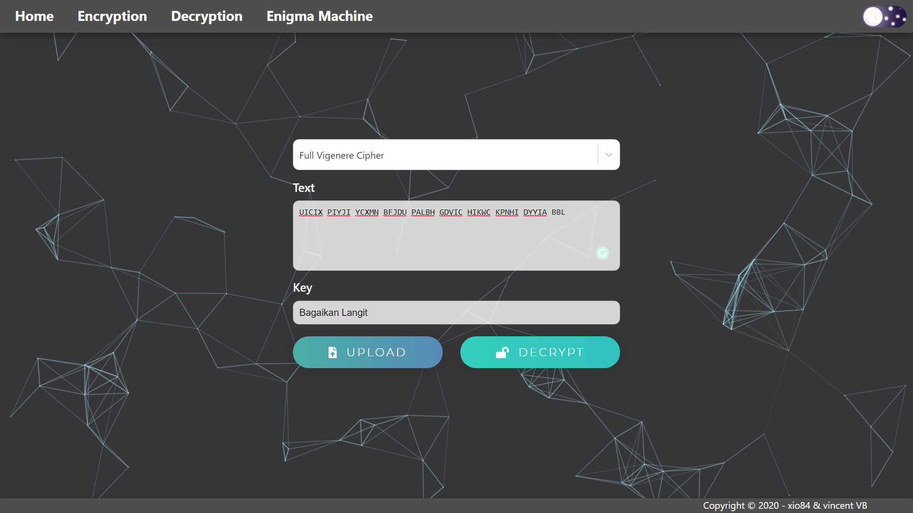
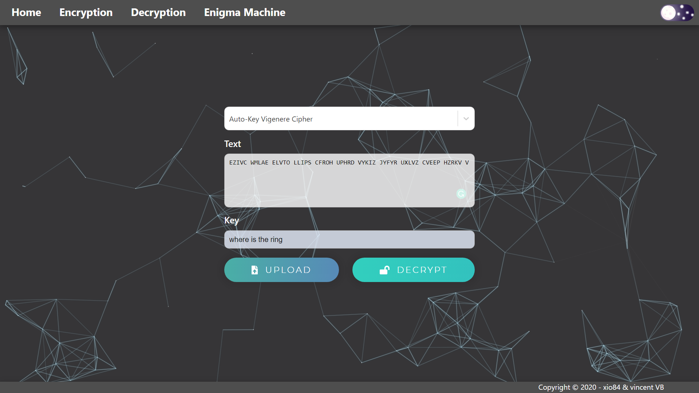
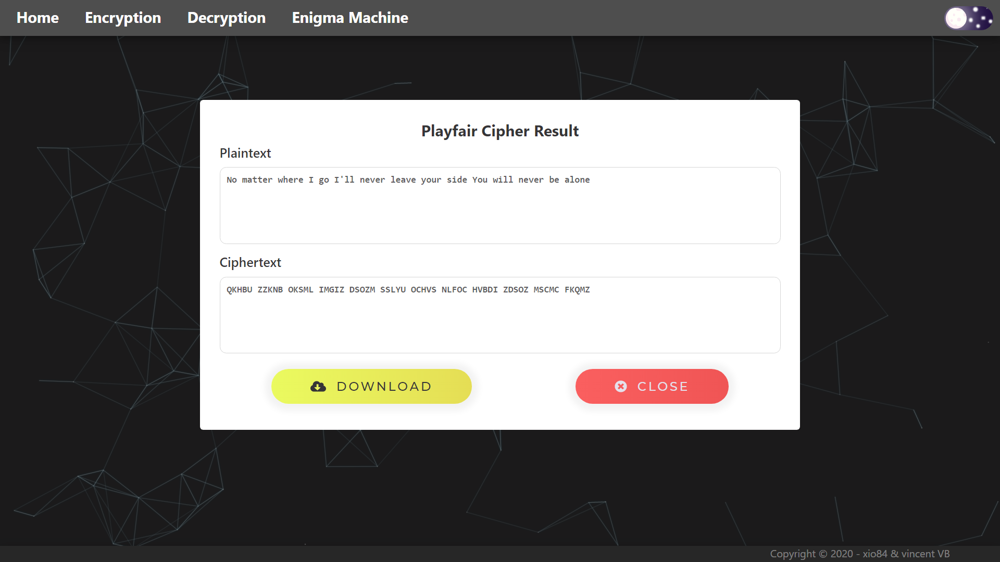
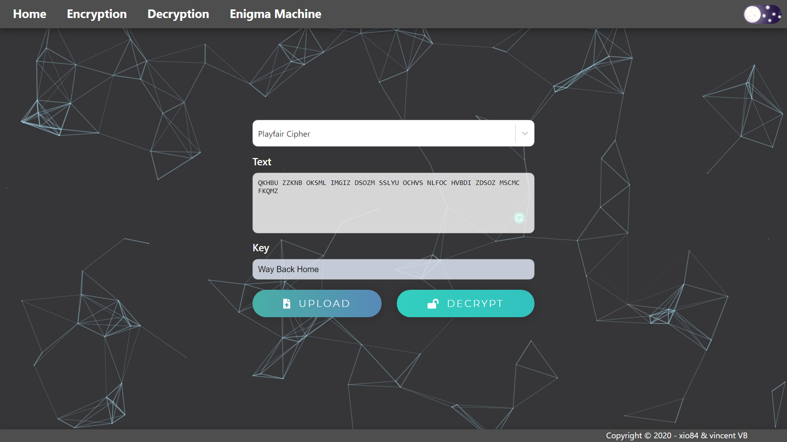

<h1 align="center">
    <b>
         
        Tugas Kecil 1 IF4020 Kriptografi
         
    </b>
</h1>

<h2 align="center">
    <b>
        Crypto Helper
         
         
    </b>
</h2>

## Deskripsi Singkat
Membuat sebuah program yang mengimplementasikan:

<ol>
    <li>
        Vigenere Cipher standard (26 huruf alfabet)
    </li>
    <li>
        Varian Vigenere Cipher (26 huruf alfabet):
        <ul>
            <li>Full Vigenere Cipher</li>
            <li>Auto-key Vigenere Cipher</li>
        </ul>
    </li>
    <li>Extended Vigenere Cipher (256 karakter ASCII)</li>
    <li>Playfair Cipher (26 huruf alfabet)</li>
    <li>Super enkripsi: Vigenere Cipher standard + cipher transposisi (bebas). Jelaskan cipher transposisi yang dibuat.</li>
    <li>Affine cipher (26 huruf alfabet)</li>
    <li>Hill cipher (26 huruf alfabet)</li>
    <li>Bonus: Enigma cipher (26 huruf alfabet)</li>
</ol>

dengan spesifikasi sebagai berikut:
<ol>
    <li>Program dapat menerima pesan berupa file sembarang (file text maupun file biner) atau pesan yang diketikkan dari papan-ketik.</li>
    <li>Program dapat mengenkripsi plainteks. Khusus untuk Vigenere Cipher dengan 26 huruf alfabet dan Playfair Cipher dengan 26 huruf alfabet, program hanya mengenkripsi karakter alfabet saja. Angka, spasi, dan tanda baca dibuang.</li>
    <li>Program dapat mendekripsi cipherteks menjadi plainteks semula.</li>
    <li>Untuk pesan berupa text, program dapat menampilkan plainteks dan cipherteks di layar.</li>
    <li>Untuk plainteks berupa text, cipherteks dapat ditampilkan ke layar dalam bentuk:
        <ul>
            <li>tanpa spasi</li>
            <li>dalam kelompok 5-huruf</li>
        </ul>
    </li>
    <li>Program dapat menyimpan cipherteks ke dalam file.</li>
    <li>Kunci dimasukkan oleh pengguna. Panjang kunci bebas.</li>
    <li>Untuk enkripsi plainteks sembarang file (khusus untuk extended Vigenere Cipher), setiap file diperlakukan sebagai file of bytes. Program membaca setiap byte di dalam file (termasuk byte-byte header file) dan mengenkripsinya. Hanya saja file yang sudah terenkripsi tidak bisa dibuka oleh program aplikasinya karena header file ikut terenkripsi. Namun dengan mendekripsinya kembali maka file tersebut dapat dibuka oleh aplikasinya.</li>
</ol>

## Tabel Fitur
| No | Feature                     | Success (✔) | Fail (❌) | Details |
|:--:|:----------------------------|:------------|:----------|:--------|
|  1 | Vigenere Cipher             | ✔           |           |         |
|  2 | Full Vigenere Cipher        | ✔           |           |         |
|  3 | Auto-Key Vigenere Cipher    | ✔           |           |         |
|  4 | Extended Vigenere Cipher    | ✔           |           |         |
|  5 | Playfair Cipher             | ✔           |           | perlu dilakukan post-processing untuk membuang huruf X tidak terpakai |
|  6 | Super Encryption            | ✔           |           |         |
|  7 | Affine Cipher               | ✔           |           |         |
|  8 | Hill Cipher (matriks 3 x 3) | ✔           |           |         |
|  9 | Enigma Cipher               | ✔           |           | ring setting tidak dapat diubah |

 

## Screenshot

### Front page & Theme
- Light mode

- Dark mode

### Page
- Encryption

- Decryption

- Enigma machine

### Vigenere Cipher
- Encryption input

- Encryption output

- Decryption input

- Decryption output

### Full Vigenere Cipher
- Encryption input

- Encryption output

- Decryption input

- Decryption output

### Auto-Key Vigenere Cipher
- Encryption input

- Encryption output

- Decryption input

- Decryption output

### Extended Vigenere Cipher (using image file)
- Input file

- Encryption file input

- Encryption

- Encrypted file download

- Encrypted file

- Decryption file input

- Decryption

- Decryption file download

- Decrypted File

### Playfair Cipher
- Encryption input

- Encryption output

- Decryption input

- Decryption output

### Super Cipher (using text file)
- Encryption input

- Encryption output

- Encryption download

- Decryption input

- Decryption output

- Decryption download

- Input files, encrypted files and decrypted files

### Affine Cipher
- Encryption input

- Encryption output

- Decryption input

- Decryption output

### Hill Cipher
- Encryption input

- Encryption output

- Decryption input

- Decryption output

### Enigma Cipher
- Encryption input

- Encryption output

- Decryption input

- Decryption output

 

## Sources
- Theme switch button created by [Raunaq Chawchan](https://codepen.io/_Raunaq_)
- Icon and logo from [pngio](https://pngio.com/images/png-a1742084.html)

    <b>
         
        
            About
        
    </b>

    <b>
        IF4020-Kriptografi - 2020
         
        Teknik Informatika 2017
         
         
        13517020 - T. Antra Oksidian Tafly
         
		13517137 - Vincent Budianto
    </b>

